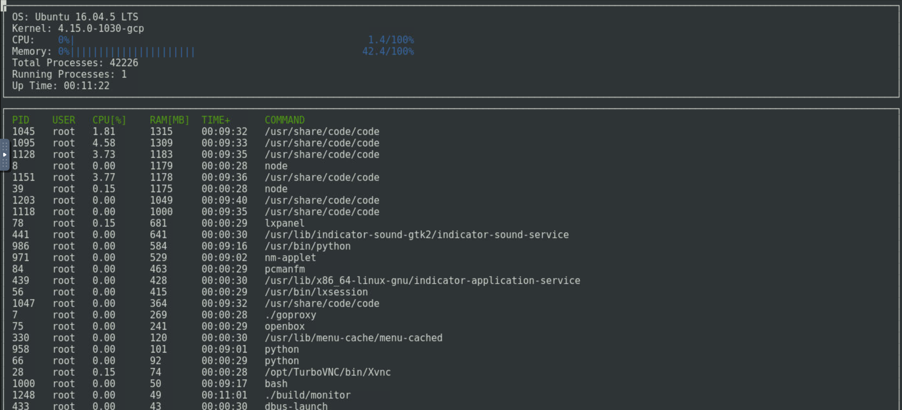

# Linux-Process-Viewer
A simple process viewer for Linux which can be used to monitor system processes. It uses the ncurses library for display purposes.

## ncurses
[ncurses](https://www.gnu.org/software/ncurses/) is a library that facilitates text-based graphical output in the terminal. This project relies on ncurses for display output. To install ncurses run: `sudo apt install libncurses5-dev libncursesw5-dev`

## Make
This project uses [Make](https://www.gnu.org/software/make/). The Makefile has four targets:
* `build` compiles the source code and generates an executable
* `format` applies [ClangFormat](https://clang.llvm.org/docs/ClangFormat.html) to style the source code
* `debug` compiles the source code and generates an executable, including debugging symbols
* `clean` deletes the `build/` directory, including all of the build artifacts

## Instructions for installation

Clone the project repository: `git clone https://github.com/vijaitj/Linux-Process-Viewer.git`

Build the project: `make build`

Run the resulting executable: `./build/monitor`

